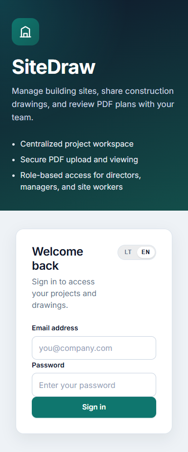
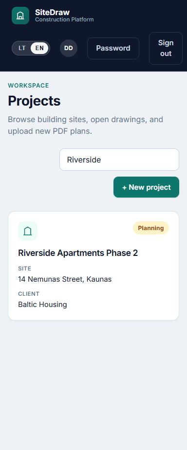
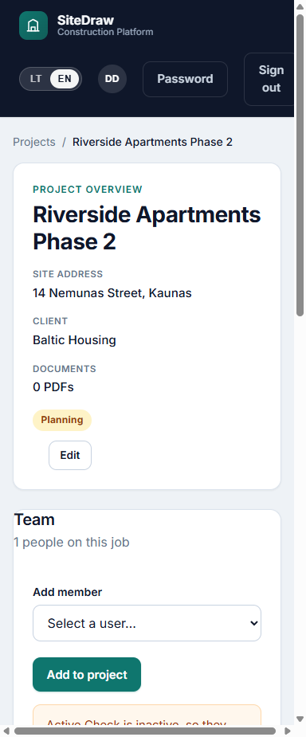

# SiteDraw

Construction document platform for project teams. Directors, project managers, and site workers can manage sites, upload PDF drawings, mark them up, and keep an audit trail.

[](https://github.com/TSimanskas/sitedraw/actions/workflows/ci.yml)



## What it does

- Sign in with JWT, change password, and (as director) manage users
- Projects with role-based access and search
- PDF upload, versioning, delete, and in-browser viewing
- Drawing annotations, scale calibration, revision history, and audit events





## Stack

- **API:** Java 17, Spring Boot 4, Spring Security, JWT, JPA, Flyway
- **UI:** React 19, TypeScript (strict), Vite, React Query, PDF.js, Fabric.js
- **Data:** PostgreSQL 16 (Docker) or H2 (`dev` profile)
- **Files:** local folder in `dev`, MinIO in `docker` profile

## Layout

```
Backend/platform/            Spring Boot API
Backend/platform/frontend/   React app (started with the API in dev)
docs/                        Screenshots and a sample drawing PDF
```

## Run locally

From `Backend/platform`:

```bash
./mvnw spring-boot:run
```

- API: http://localhost:8080
- UI: http://localhost:5173

The `dev` profile starts the Vite frontend next to the API. Node.js must be on your PATH.

### Docker infrastructure

```bash
cd Backend/platform
docker compose up -d
./mvnw spring-boot:run -Dspring-boot.run.profiles=docker
```

PostgreSQL is on 5432, MinIO on 9000 (console 9001).

### Local demo user

The `dev` profile seeds one director account so you can sign in without creating a user first. It is documented here only, not on the login screen:

`director@construction.local` / `Director123!`

Set `APP_JWT_SECRET` to a long random value before deploying. The H2 console is only open on the `dev` profile.

## Tests

```bash
cd Backend/platform
./mvnw test
cd frontend && npm test
```

GitHub Actions runs both suites on every push.

## Built as

A full-stack portfolio project: layered Spring services, JWT auth, RBAC, PDF markup, Flyway migrations, Docker Compose, and CI.
